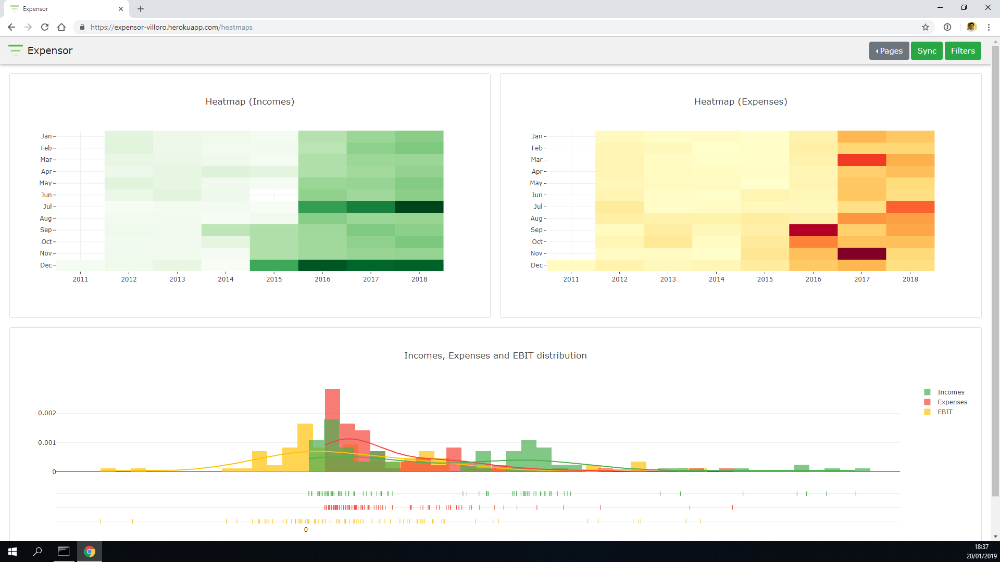
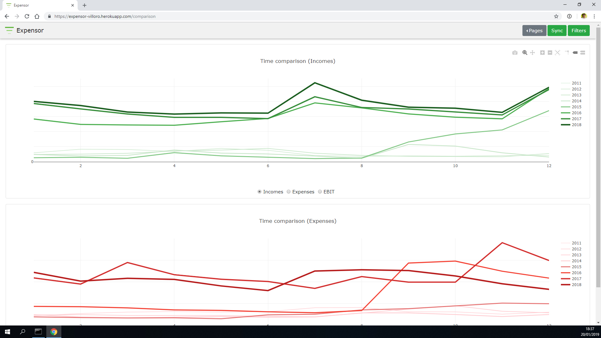

#  Expenses Visualization App (expensor_personal)
[](https://travis-ci.com/villoro/expensor_personal)
[](https://codecov.io/gh/villoro/expensor_personal)

This is a [dash](https://plot.ly/products/dash/) app that allows me to visualitze my financial data. This includes expenses, incomes, EBIT, liquid and investments.

**It is intended only for personal use.** There is another repository ([expensor](https://github.com/villoro/expensor)) with a similar dash app for public use. However, if you want, you can use the code of this app or fragments of it.

It takes personal information from dropbox and uses dash login to verify the identity.

Some screenshots (with personal data hidden):





## Installation
1. Download the code 

    ```git clone https://github.com/villoro/expensor_personal.git```

2. Install requirements

    ```pip install -r requirements.txt```

3. Run the app

    ```
    python src/index.py
    ```

4. Register a dropbox app ([Documentation](https://www.dropbox.com/developers/reference/oauth-guide))

5. Set environment variables
    - **EXPENSOR_DROPBOX_TOKEN:** dropbox token
    - **EXPENSOR_USER:** user for login
    - **EXPENSOR_PASSWORD:** password for login
    
## Data needed
In order to set up the app you will need two excel files inside the dropbox app folder:
* your_app/Money Lover/YYYY-MM-DD.xlsx
* your_app/data.xlsx

### Money Lover/YYYY-MM-DD.xlsx file
The first excel file will be a raw export from [Money Lover](https://moneylover.me/) android app. The dash app will scan the `Money Lover` folder and take the newest excel file based on it's name.

This excel file needs the following columns:

| Date       | Amount | Category |
|------------|--------|----------|
| 2017/01/01 | -500   | Rent     |
| 2017/02/01 | -500   | Rent     |
| 2017/03/01 | -500   | Rent     |
| 2017/01/01 | 1150   | Salary   |
| 2017/02/01 | 1250   | Salary   |

Note that expenses will have negative amounts and incomes positive ones.

### data.xlsx file
This file should have the following sheets:
* liquid_list
* liquid_m
* invest_m
* worth_m
* trans_categ

#### liquid_list sheet
This states the different accounts with liquid and how liquid each account is. It needs the following columns

| Name        | Liquidity level | Liquidity   name |
|-------------|-----------------|------------------|
| ING Account | 1               | liquid           |
| ING Deposit | 2               | deposit          |
|   Revolut   | 1               | liquid           |

#### liquid_m sheet
This will have the money in each account for each month. It should have `date` and `Total` as columns followed by one column per each account stated in the previous sheet. For example:

| Date    | Total | ING Account | ING Deposit | Revolut |
|---------|-------|-------------|-------------|---------|
| 2018/10 | 680   | 100         | 500         | 80      |
| 2018/11 | 700   | 150         | 500         | 50      |
| 2018/12 | 680   | 120         | 500         | 60      |

#### invest_m and worth_m sheets
This will be a list of the money invested (invest_m) and the value of the investments (worth_m) at each month per each investment account. Those can be different from the ones listed in `liquid_list`.

For example:

| Date    | Total | betterment | vanguard |
|---------|-------|------------|----------|
| 2018/10 | 600   | 100        | 500      |
| 2018/11 | 650   | 150        | 500      |
| 2018/12 | 620   | 120        | 500      |

#### trans_categ sheet
This is a list of all possible categories for the transactions listed in `Money Lover/YYYY-MM-DD.xlsx` file. It will show if they are **Expenses** or **Incomes** and the color that should be used when plotting. For example:

| Name   | Type     | Color Name | Color index |
|--------|----------|------------|-------------|
|  Food  | Expenses | blue       | 500         |
| Salary | Incomes  | red        | 500         |
|  Rent  | Expenses | green      | 500         |


All available colors can be found at [Meterial Design Guidline](https://material.io/design/color/the-color-system.html#color-usage-palettes)

## Authors
* [Arnau Villoro](villoro.com)

## License
The content of this repository is licensed under a [MIT](https://opensource.org/licenses/MIT).

## Nomenclature
Branches and commits use some prefixes to keep everything better organized.

### Branches
* **f/:** features
* **r/:** releases
* **h/:** hotfixs

### Commits
* **[NEW]** new features
* **[FIX]** fixes
* **[REF]** refactors
* **[PYL]** [pylint](https://www.pylint.org/) improvements
* **[TST]** tests